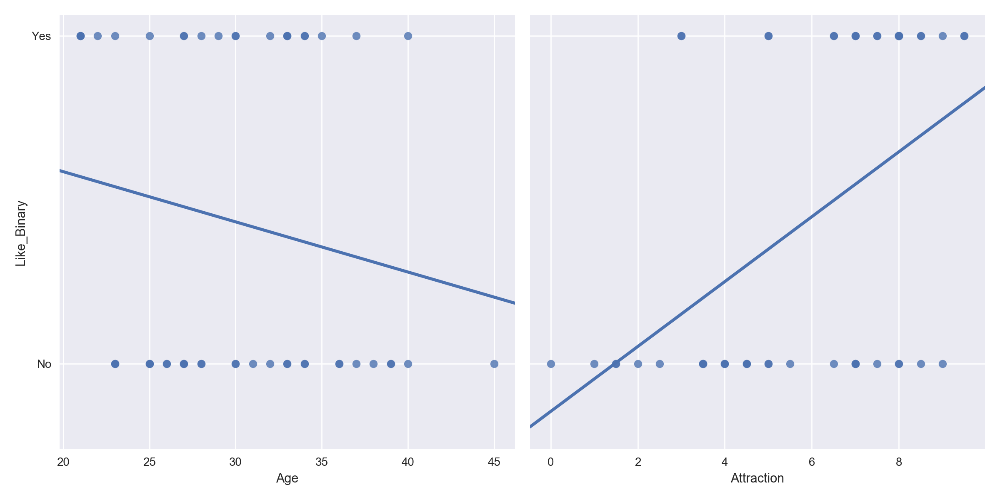
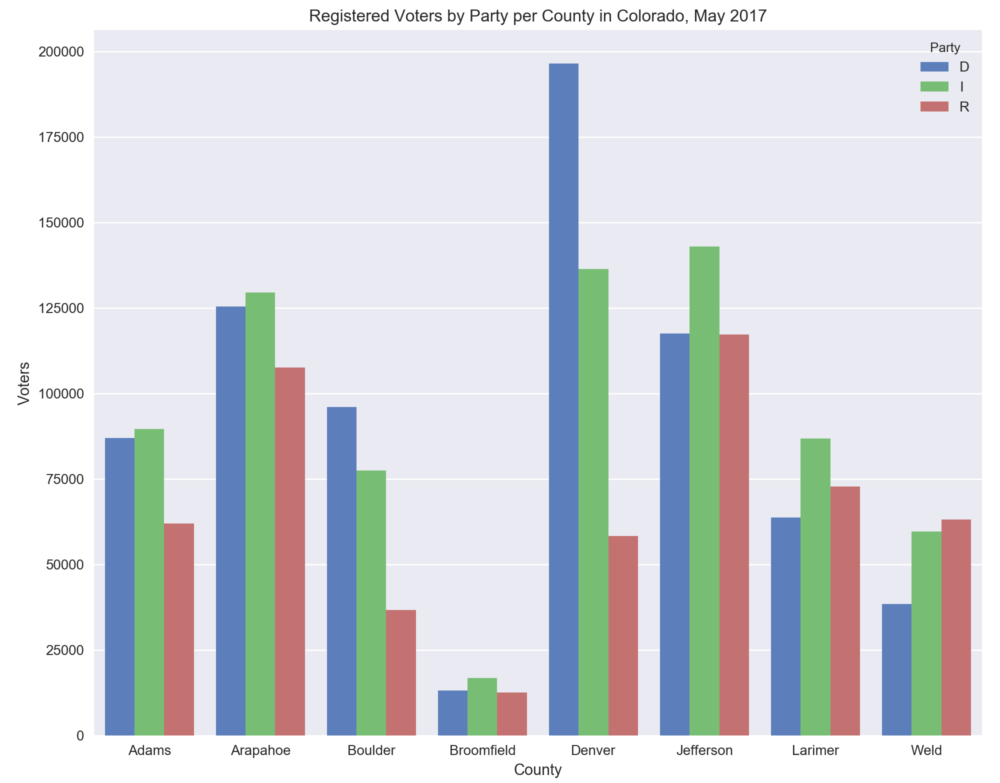
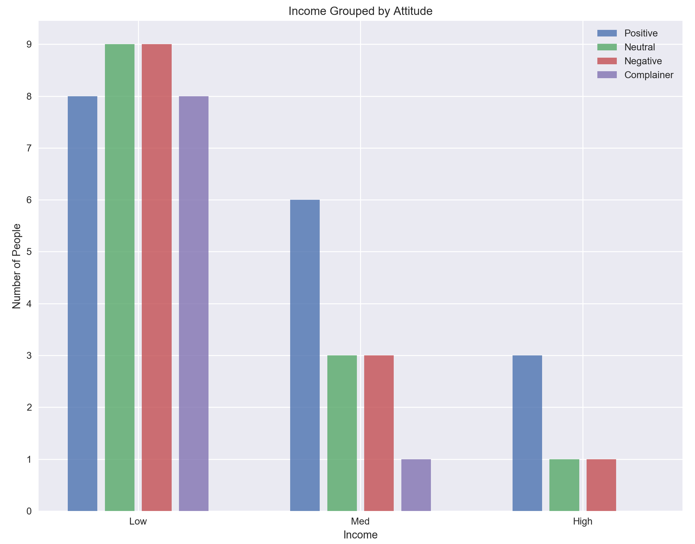
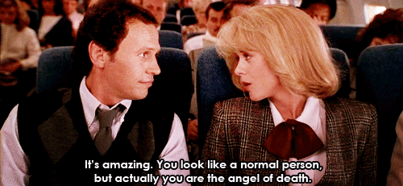

# My So-Called (Dating) Life

As part of my helping teach the "_Data Science: Intro to Python_" course, I made a database of some of my dating history.  It was used to introduce new students to Pandas -- see the accompanying [Jupyter Notebook](/intro_to_pandas_jpw_lecture.ipynb) for the actual lecture -- and I then wondered about the importance of factors in my own personal affinity for dating certain people versus others.  So, I quickly built a model to do a little investigating.  

## Table of Contents
1. [The Data-base Breakdown](#the-data---base-breakdown)
    + [Feature Definitions](#feature-defintions)
2. [Super Model](#super-model)
    + [Data Prep](#data-prep)
3. [The First Time](#the-first-time)
    + [Feature Importance](#first-run-feature-importance)
    + [Relative Correlations for Age vs Attraction](#relative-correlations-for-age-vs-attraction)
    + [Logit Coefficients](#logit-coefficients)
4. [Age is Just a Number](#age-is-just-a-number)
    + [Binning](#binning)
5. [Second Run](#second-run)
    + [Feature Importance](second-run-feature-importance)
    + [Dare to Nair](#dare-to-nair)
    + [Feature Importance Without Hair](#feature-importance-without-hair)
    + [Height](#height)
    + [Intellect and Humor](#intellect-and-humor)
    + [Bad Dates](#bad-dates)
6. [Politics](#politics)
    + [Voters by County](#voters-by-county)
7. [Chemistry](#the-physical-chemist)
    + [Feature Importance](#feature-importance-with-chemistry)
8. [Attitude is Everything](#attitude-is-everything)
    + [Attitude Counts](#attitude-counts)
    + [Attitude and Income](#attitude-and-income)
9. [Check Please](#check-please)
10. [References](#references)

### The Date-abase Breakdown
My dating database had the following variables:

Variable                |  Type       | Values
------------------------|-------------|------
Age                     | Numeric     | 21 - 45
Height (in)             | Numeric     | 60 - 74
Attraction              | Numeric     | 0 - 10
Intellectual Connection | Numeric     | 0 - 10
Humor                   | Numeric     | 0 - 10
Chemistry*              | Numeric     | 0 - 10
Hair                    | Categorical | Blonde, Brunette, Red
Life Attitude           | Categorical | Positive, Neutral, Negative, Complainer
Politics                | Categorical | Left, Right, Independent
Income                  | Categorical | Low, Medium, High
Divorced                | Binary      | Yes, No
Kids                    | Binary      | Yes, No
Second Date?            | Binary      | Yes, No
Did I Like This Person? | Binary      | Yes, No

 __Table 1:__ The variables I assigned to each person in the database. Note the asterisk next to _Chemistry_.  This denotes that it was added only after an initial run without it included.

 

##### Feature Definitions
Let me quickly clarify how certain variables were assigned.  
+ __Attraction:__ Physical attraction only.
+ __Intellectual Connection:__ Basically the mental equivalent of attraction.
+ __Humor:__ How well our senses of humor aligned; did I laugh a lot with this person?
+ __Chemistry:__ The level of physical chemistry.
+ __Life Attitude:__ This is an appraisal of the person's general attitude in life.  
    + __Positive__: Generally optimistic, able to handle changes (even minor things like change of plans on a   date) well.  If the waiter makes a small mistake on their order, they just take off the unwanted food or, if necessary to address it, do so politely and don't mention it again.  Has a good view of the "big picture."  
    + __Neutral__: Depends on the mood or situation.  More of a 'nondescript' attitude.
    + __Negative__: Generally pessimistic.  Sees obstacles as larger than they are, lets little things bother them.  Would say things like "I don't want to go to [Place X] because they messed up my order one time."
    + __Complainer__: A specific sub-set of _Negative_, in that I found the person to be routinely not just negative in a "pessimistic about life" sense, but to explicitly complain about many things and people.  If the waiter made a mistake with their order, they would let it impact their ability to enjoy the meal, be fairly snarky to the waiter while demanding a correction, and finally -- and this is the _coup de grâce_ -- they would mention it as the first thing when someone asked about the date.  Like, who cares?  Your order wasn't perfect.  Wow.  Big deal.  Get a life.  How on earth these people can find any happiness in life, I will never know.
+ __Income:__ Since I don't have the tax returns of everyone in this database, I don't know exactly where they fall in income.  Things such as vocation, if they owned a home, neighborhood they lived in, type of car, cost of hobbies, and clothing and jewelry.  It is imperfect but is likely representative to a fair degree.  So I made the following rough annual income approximations.
    + __Low__: less than $40,000
    + __Medium__: between $40,000 and $80,000
    + __High__: above $80,000
+ __Second Date:__ Whether I saw this person a second time or not.  On the surface this seems like it would be an easy winner for most predictive variable -- if I "liked" someone then surely I'd see them again, right?  Well, life isn't always so cut-and-dried.  Sometimes circumstances change.  Sometimes you like someone that doesn't like you.  Sometimes you met only by chance to begin with.  Hence the inclusion of this feature.
+ __Did I Like This Person?:__ At the end of the day, whether I would consider full-on dating this person or not.  Ultimately, this is the target of the whole endeavor -- to find someone you'd like to date and, in my case, marry.

 

### Super Model
My main interest in this mini-project was simple: to see which variables had the strongest relationship to predicting whether or not I liked someone enough to consider dating them.  For this I used a Gradient Boosted Classifier from __XG Boost__.  I intentionally overfit the model (500 trees, tree depth of 4, and learning rate of 50%) because I am not interested in building a predictive algorithm using the limited variables I have.  The primary issue in doing so is that some of the variables such as attraction, humor, intellectual connection, chemistry, politics, and second date can only be answered fairly after I've met someone.  Thus this is a _descriptive_ project and not an _inferential_ or _predictive_ one.  

The final rankings of which features are most important in deciding whether or not I "liked" someone are given by the `.feature_importances_` attribute of the fitted model.  These are determined by the amount of [information gained](https://en.wikipedia.org/wiki/Entropy_(information_theory)) if using __entropy__ as the metric to evaluate successful node splits in a tree, or from the magnitude of increase in node purity if using the [Gini coefficient](https://www.stat.berkeley.edu/~breiman/RandomForests/cc_home.htm#giniimp) instead.

##### Data Prep
There were three stages to data prep in this project.  
1. Dummy the categorical and binary variables.
2. Address the _Age_ over-importance issue (see below).
3. Add _Chemistry_ feature.

 

### The First Time
Fo the first run of the model I had not yet created the _Chemistry_ variable, or as they say in Russia, there was no "_chim-ih-stree_."  Initially I did not have the _Chemistry_ variable included, and it turns out this mattered.  We'll come back to this in our second run below.  Here are the top 10 features for the (overfit) GBC model:

###### First Run Feature Importance
Rank | Feature                 | Importance
-----|-------------------------|-----------
1    | Age                     | 54.9%
2    | Humor                   | 13.6%
3    | Attraction              | 13.6%
4    | Height (in.)            | 8.1%
5    | Intellectual Connection | 3.2%
6    | Hair Brunette           | 1.9%
7    | Second Date (No)        | 1.7%
8    | Attitude Positive       | 1.3%
9    | Politics Left           | 0.8%
10   | Income Low              | 0.8%

 __Table 2:__ The top 10 features from my initial run, without _Chemistry_, and without any data prep apart from dummied variables.

 

My initial reaction to this result was one of surprise.  Age?  Really?  That's the overwhelmingly most predictive feature for whether or not I liked someone?  That sure didn't _feel_ right, so I did a quick visual inspection to see if this made sense by looking at the basic Pearson R2 correlation between _Age_ and a binary version of the _Like_This_Person?_ target, as well as the same for _Attraction_.

###### Relative Correlations for Age vs Attraction

 __Figure 1:__ Comparison of _Age_ and _Attraction_ correlation to 'Liking' someone.

 

Visually the result doesn't support the feature importance results above.  The slope for _Age_ is much flatter than that for _Attraction_.  This is not a definitive result (for one, because we shouldn't use a linear regression in this situation); it's just a basic litmus test to see if things are in the right ballpark.  This plot suggests that we are not.  

##### Logit Coefficients
Curious, I wanted to find the basic correlation between _Age_, _Attraction_, and _Like_This_Person?_ to further support that the initial feature importances seemed askew.  Since our dependent variable of _Like_This_Person?_ is binary, a standard OLS linear regression is [not advised](http://thestatsgeek.com/2015/01/17/why-shouldnt-i-use-linear-regression-if-my-outcome-is-binary/).  So, using __Sci-Kit Learn__'s `LogisticRegression` module (`C=1.0, penalty='l1'`), the following coefficients were calculated for the two variables in question.

Variable   | Logit Coefficient
-----------|:----------------:|
Age        | -.011
Attraction |  .353

 __Table 3:__ Logistic Regression coefficients for Age and Attraction, showing a greatly diminished importance for Age.

 

This isn't meant to be a comprehensive logistic regression report using an optimally-tuned Logit model, but rather a guideline as to the relative importance of each feature.  So both graphically (__Figure 1__) and mathematically we are seeing that _Age_ does not appear to be particularly important.  But our (more advanced) gradient boosted model said that _Age_ was not just important, but the most important feature by a mile.  What gives?

#### Age Is Just A Number
Well, this is where understanding what's going on "under the hood" for the models we are using shows its importance.  When using a decision tree-based model, of which gradient boosting is an ensemble version, there is a specific susceptibility for inflated feature importance reporting if a feature can take on a large range of unique values relative to other features in the dataset. [__1__](#fn1)  As the decision tree makes a split, many of the features in this dataset are binary (dummied) and provide little difference for the model to measure.  

Looking back at [Table 1](#the-database-breakdown), we see the range of values that _Age_ can take is double any other numeric feature!  The model is getting a unique value on every split of _Age_ at around twice the rate it is for the other numeric columns and an order of magnitude more than the binary ones.  Thus, it seems safe to say that the reported importance of _Age_ is a relic of the database's construction and is not indicative of its true value in determining if I will "like" someone.

Clearly we need to fix this error.  A first thought might be to simply dummy the _Age_ variable as we did with the categorical ones at the beginning of the project.  However, this would result in two problems.  First, this would create N = `df['Age'].unique().shape[0]` = 20 dummy columns.  Second, we risk completely losing the essence of the _Age_ variable.  With 20 columns each only representing a single age, it is incredibly unlikely that any single age will register as "important."  This is due to there being relatively few entries of any given age, so the each split on a given column of age is unlikely to include a "yes" for that age -- there just aren't going to be a majority of people in this database that share the exact same age.  

Further, what if the model said "Age 31" is the most important age?  What would that really even mean?  Are we saying that I am only going to "like" someone if they're 31?  If I met that same person a week before or after they were 31 years old, would I not like them equally as much?  It appears that a basic dummying of the _Age_ column is not going to resolve our issue.  Fortunately, there is an easy and interpretable solution.

##### Binning
Instead we will __bin__ our _Age_ data.  As anyone who's made a basic histogram in MS Excel knows, you sort data into groups based on different cutoffs.  For our _Age_ data, we'll bin into quintiles (fifths).  This way we can have a group structure of "very low, low, average, high, very high" for the ages in the database.  There is one catch, though, and that is the _count_ of people in each group.  Are we going to make the group cutoffs based on percentile ranking or percentile membership?  

For a quintile binning, the ranking approach simply takes all the data points in the bottom 20th-percentile (the first quintile) and puts them in the "very low" bin, data points in the 20th- to 40th-percentile (the second quintile) and puts them in the "low" bin, all the way up to data points above 80th-percentile (the fifth quintile) being shoved into the "very high" bin.  If your data is distributed roughly evenly, this is fine, else it is vulnerable to outliers causing greatly imbalanced bins.  

Let's pretend there was a person of age 55 in this database.  Using a percentile ranking, this person would rank in the 100th-percentile and the nearest person below them would be in, oh, the ~70th-percentile.  As a result, the top bin of "very high" would have _only one person_.  What statistical conclusions can be drawn from a lone data point?  (Hint: none).  In Pandas, this method is `pd.cut()`.

The other option is to bin the data based on _count_.  We simply count the number of data points and put the bottom scoring fifth into the "very low" bucket, regardless of if they're all actually below the 20th-percentile in their value.  We repeat this for each bracket, up to taking the highest fifth of the dataset and putting it into the "very high" bucket.  This approach ensures (as close to possible) balanced bins and is impervious to extreme outliers.  This is the route we will follow in this model.  In Pandas, this method is `pd.qcut()` (which stands for "quantile cut" and can divide your data into any N number of divisions).

 

### Second Run
With our binned _Age_ variable, the feature importance results are notably different and, anecdotally speaking as the person who has met the people in this database, much more accurate.

###### Second Run Feature Importance
Rank | Feature                 | Importance
-----|-------------------------|-----------
1    | Height (in)             | 19.3%
2    | Attraction              | 15.1%
3    | Hair Brunette           | 14.9%
4    | Hair Blonde             | 12.7%

 __Table 4:__ Feature importance results after binning the _Age_ variable. 

 

...and what a difference proper data preparation has made!  By binning the wide-ranging _Age_ column we have let the other features in the model "breathe," giving them a chance to show their relative importance much more accurately.  The results themselves are somewhat interesting.

First, note that the two types of hair are basically equal, showing that I don't seem to have a preference based on hair.  This is a fun finding for me, because I would have absolutely said that I prefer "dark" hair over blonde hair, but all things equal it seems that has very little to do with whether or not I actually consider someone as a good candidate to date long-term.  In a sense, this makes both features redundant -- every woman I have dated has had hair, so we aren't learning anything by keeping it in the model at this juncture.

##### Dare to Nair  
Before we proceed without _Hair_ (hey, to each their own), it's worth noting the breakdown of the category.  In the dataset there are 26 Blondes, 24 Brunettes, and 1 Red.  Further backing the notion that I don't seem to have a real preference is that the mean _Attraction_ for both brunette and blonde is nearly identical at 5.88 and 5.87, respectively.  Again, this is news to me!  It's definitely an experience to see your own life be churned out in data and tell you something you might not have known about yourself.  

Someone inexperienced with data science might also conclude that the fact there is only one redheaded person in the database means I am not attracted to women with red hair.  But, as always, we have to dig one level deeper to see if we can properly contextualize the results we get.  In this case, there are 51 total people in this database.  One has red hair.  That's just a, uh, _hair_ beneath 2% of the total database.  Well, a quick [Google search](https://www.google.com/search?q=what+percentage+of+people+have+red+hair&oq=what+percentage+of+people+have+red+hair&aqs=chrome..69i57.11005j0j7&sourceid=chrome&ie=UTF-8#q=what+percentage+of+people+have+red+hair?) gives us the context we are looking for.  

Care to guess what percentage of the world population has red hair? ...if you said 2%, you win the Daily Double!  So, the occurrence of a lone red headed person in the database is in line with what we'd expect given the size of the database (though, it would vary by country.  The USA seems to be a fairly close representative of world red haired ratios).  Thus, we can't say anything conclusively whatsoever about my preference for or against red hair!

Now, let's run the model with _Hair_ removed altogether.

###### Feature Importance Without Hair
Rank | Feature                 | Importance
-----|-------------------------|-----------
1    | Height (in)             | 33.3%
2    | Attraction              | 18.0%
3    | Intellectual Connection | 15.7%
4    | Humor                   | 13.0%
5    | Politics Left           | 8.9%
6    | Second Date (No)        | 5.9%
7    | Attitude Positive       | 3.2%
8    | Income Low              | 2.1%

 __Table 5:__ Feature rankings with the _Hair_ column removed. 

 

###### Height
It looks like the biggest beneficiary of removing _Hair_ was _Height_, as its importance increased by around 14% relative to the rest of the database, keeping it in the pole position.  Having _Height_ as the most important feature presents us with an excellent opportunity to point out that tree-based feature importances don't tell us whether a higher or lower value of a given variable helps predict the desired outcome, only that _one of the two_ does.  In the case of _Attraction_, the obvious conclusion is that people I was more attracted to are going to be more likely to be "liked" by me and considered a possible fit for long-term dating.  

But we have no such obvious conclusion with _Height_.  It could mean that I routinely "liked" taller women, or that I routinely "liked" shorter women.  We don't know from this table alone.  One way to find out would be to do some exploratory data analysis (EDA) on the dataset and see if we could note the trend ourselves.  Yet another option would be to ask me, since I probably have an inkling of which type of person, taller or shorter, I seem to respond favorably to.  I would think this hunch should be especially evident to the subject (I) since _Height_ appears to be such a salient factor.

###### Intellect and Humor
Following _Height_ and _Attraction_ are _Intellectual Connection_ and _Humor_.  It makes sense that these features round out the top four.  When we think of choosing a partner, obviously we would like to be attracted to them (studies have shown that men tend to value attraction slightly more than women, to no one's surprise).  But right along with attraction we want someone we can "connect" with (see: hold multiple conversations that are actually stimulating) and someone who can make us laugh or that we can laugh with.  I surely would have said as much before making this project, so it's pretty neat to see the data bear it out!

###### [Bad Dates](https://www.youtube.com/watch?v=0qIMTA4_YdU)
We should quickly touch on _Second Date (No)_.  Despite the possibilities for undesired absences of second dates mentioned in the intro, it appears that most of the time a second date doesn't occur has probably been either my choice or a mutually agreed upon lack of interest.  I say this because of the feature's appearance here.  Again, these feature importances don't tell us directionality, but with the category being split into a _(No)_ sub-set, we can conclude that the absence of this feature (meaning that there actually was a second date, since the "No" column would be empty) correlates to my "liking" someone.  This makes sense.

 

### Politics
_Politics Left_ is a bit of a surprise, personally.  I'm a registered independent and find radical political views on either side to be a moderately off-putting trait in a potential partner.  I find strict ideology in general is a suffocator of innovation and critical thinking.  I can't help but wonder if there's not something more to this, else I might just chalk it up to being [fake news](images/fakenews.jpg).

 

###### Walking Down the _Other_ Aisle
Leaning     | Count | Attraction | Intel. Connect. | Humor | Chemistry
------------|-------|------------|-----------------|-------|-----------
Left        | 33    | 5.7        | 5.0             | 4.8   | 5.0
Right       | 14    | 6.4        | 4.3             | 5.0   | 6.0
Independent | 4     | 4.5        | 9.1             | 9.0   | 5.0

 __Table 6:__ Mean summary values for each political affiliation in the database. 

 

Interesting.  There isn't anything that jumps off the page and screams "I clearly favor women who have liberal leanings."  Women leaning left politically edge out those leaning right in only one of the four variables, _Intellectual Connection_.  Conversely, conservatives come out on top in _Attraction_, _Humor_, and _Chemistry_.  But none of these "leads" are particularly resounding.  _Humor_ is almost deadlocked, and the other three categories are roughly mirror images of each other.  

There are, however, two pronounced observations to be made.  First, the number of democrat women more than doubles that of republicans.  Again, someone eager for a quick conclusion might read that as suggesting I like to date liberal women twice as much as conservative women.  But, we can do better than such surface level takes.  The key element to any demographic sample like this is: where was it taken?  The entirety of this dataset was taken during my time living in or near Boulder, CO and the surrounding Denver metro area.  It is not surprising then that we'd expect to see a strong prevalence of democrats in this sample.

Out of curiosity, I looked up voter registration statistics for the counties I've lived in or that neighbored me.  

###### Voters by County

 __Figure 2:__ Voters by neighboring counties in CO, May 2017.

 

Well, the interesting point to me as an independent voter myself is how numerous independent voters are!  In fact, it looked like this might be the result of an error, but a hasty Google search showed that 37% of all Colorado voters are independent/unaffiliated! [__2__](#fn2)  This stunned me.  I assumed it was around 15%.  Regarding the ratio of left-to-right political representation in the database, I've lived mostly in either Boulder or Broomfield counties.  It is not surprising that a higher percentage of my dates have been with liberal women, then.  It would be foolish to conclude that I have a predilection for dating women with liberal views just based on the number of such women I have dated when statistically it is right in the range we'd expect based upon geography.  

Only two counties, Weld and Larimer, have more registered republican than democrat voters.  Both counties are at the northern border of the state and are home to much of the state's oil and gas industry.  In the other six counties republican voters are in last place (Adams, Arapahoe, Boulder, Denver) or tied for last (Broomfield, Jefferson).  The selection pool is just smaller for conservative-minded partners in this area of the state.  It's that simple.

However, __Figure 2__ also suggests that I have had a dearth of independent voters in my dating experiences, which when we see how highly they rate in _Intellectual Connection_ and _Humor_ -- the third and fourth most important features in the "hairless" run of the model! -- is something of a real shame.  In fact, independent voters are the leading registration alignment in five of the eight counties!  Absolutely shocking results to me.  If I was to glean any advice going forward from this mini-study, it would perhaps be to make an effort to try to meet more independent voters.

 

### The Physical Chemist
In a moment of inspiration after fixing the _Age_ binning issue and investigating political and hair color trends, I realized I had not included a potentially important variable: _Physical Chemistry_.  Anyone who has been in a serious relationship knows that a large component of appeal and happiness stems from physical chemistry.  A general quality of "do this person and I 'click' with each other physically?" is a core component of the glue that holds a relationship together.  As such, I added it to the database and ran the model again.

 

###### Feature Importance With Chemistry
Rank | Feature                 | Importance
-----|-------------------------|-----------
1    | Chemistry               | 62.8%
2    | Height (in)             | 8.6%
3    | Attraction              | 6.9%
4    | Humor                   | 6.3%
5    | Politics Left           | 5.9%
6    | Intellectual Connection | 3.3%
7    | Second Date (No)        | 3.0%
8    | Attitude Positive       | 2.4%

 __Table 7:__ Feature importances with _Chemistry_ included.  Note that _Hair_ is still excluded. 

 

There's just no overriding biology, is there?  _Chemistry_ absolutely obliterates every other factor.  When I initially set out on this fun little endeavor, I was expecting (hoping?) to find a result that had _Intellectual Connection_ at the top.  It is, after all, a trait I believe contributes very strongly to a long and happy relationship.  And while that exact statement may be true -- that an intellectual rapport between you and your partner is necessary for sustained fulfillment -- it seems clear that it isn't the factor that's going to __get__ you into a long relationship in itself.  The numbers don't lie, and they speak a resounding oration in this discussion.  

If I have good chemistry and feel comfortable with someone, then I will probably "like" them enough to want to continue seeing them.  If we don't have a comfortable connection in that aspect, then it seems clear that the concept of being with that person for the long haul is a no-go.  

In real chemistry, we say "like dissolves like," referring to solvents.  And I suppose that's largely what's at work here.  If there is a productive reaction together, then you both feel alike and this feeling (a potentially admittedly rare one) can dissolve away other impediments, such as political differences or slightly diverging senses of humor, allowing a successful relationship to precipitate out.  The differences in other areas likely act as a product loss -- you aren't going to achieve maximum possible solvency if you intermittently come to loggerheads over politics and humor -- but you are at least miscible enough to overcome the activation energy required to start the relationship in the first place.

Okay, that's the last of the chemistry-laden metaphors.  I promise.  All things equal, I think this makes sense, somewhat disappointing though it may initially be.  No matter how attracted you are to someone, no matter how much you laugh, or how lockstep you are with each other on politics or world affairs, if you are romantically involved with each other and it doesn't feel right, there's just no realistic chance you would want to continue seeing that person in a romantic role.  Basic biology wins again.  

I guess I wouldn't be here to write this and you wouldn't be here to read it if this wasn't the case.  So, in a way seeing _Chemistry_ at the top of the list is an affirmation that I'm wired like all my ancestors before me, and this is a vestige of epochs of life that saw our species' survival play out strictly as a game of numbers.  

 
 

### Attitude is Everything
On a lark, I had a question come up that I wanted to poke around on.  "__Does personal attitude correlate with personal income__," I wondered?  While my little dating dataset would by no means provide any sort of conclusive answer to this, I thought it might be fun to see how the numbers played out.  Now, recall that I had no clue what the answer would be, nor did I even consider this as I was making the database.  For clarity, let's take a look at the breakdown of the _Attitude_ category.

###### Attitude Counts
Attitude   | Income | Count
-----------|--------|------
Positive   | Low    | 8
Positive   | Medium | 5      
Positive   | High   | 3    
Neutral    | Low    | 9   
Neutral    | Medium | 3      
Neutral    | High   | 1    
Negative   | Low    | 9    
Negative   | Medium | 3       
Negative   | High   | 1     
Complainer | Low    | 8      
Complainer | Medium | 1         

 __Table 8:__ The number of people in the database that have a given income at a given attitude. 

 

We see a fairly general trend -- more people in low than high income brackets -- with a few more _Positive_ than the rest, and _Complainer_ has the fewest (which is a good thing).  So, if there's no real trend then we should have a roughly equal even breakdown of incomes.  If, however, there is some underlying component of attitude that might correlate with personal income, it would likely show up to some degree in a plot.

 __Figure 3:__ People's income as grouped by what I found their personal attitudes to be.

 

This is my favorite result from this entire project!  I've always believed that a positive attitude in life is going to net better outcomes.  You handle stress better.  You handle short-term obstacles better.  You handle your failures better.  You handle _others'_ failures better.  You see challenges as ways to learn and grow instead of likely ways to falter.  This chart tickles me pink.

Do recall again that I made this database without any notion of these results.  This question wasn't even one I had conceived until I began writing my lecture on using this database as a means to demonstrate basic concepts in Pandas.  And we should also note that something like "personal attitude" is inherently a malleable concept.  What I consider "neutral" someone else may peg as "positive."  By nature I am inherently strongly positive and I naturally seek this quality in others, especially a partner.  So, to see this breakdown implies a few things, none of which are conclusive of course, but all of which are interesting.

First, if there is a link between personal attitude and financial success, these results suggest my labels of people's attitudes are reasonably accurate.

Second, these groupings may imply that either I am slightly mislabeling people's incomes or that I have had a larger than average share of low income people in my dating life.  I feel very strongly that overall the income labels I assigned are representative.  That in itself might be more a reflection of the partners I was encountering than anything else, I suppose.  Still, if I got the income category 90% right, that would mean that up to five people were misclassified, which could change the layout of __Figure 3__.

Third, these results would seem to suggest (only suggest) that there could indeed be a relationship between personal attitude and financial success.  The most negative group, _Complainer_, has eight of its nine entries (88.9%) in the _low_ bracket.  The lone exception is in the _medium_ group, meaning the _Complainer_ group is the only one that doesn't have anyone in the _high_ income group.  See for yourself:

###### Attitude and Income
Attitude   | Perc. Low | Perc. Medium | Perc. High
-----------|-----------|--------------|-----------
Positive   | 50.0%     | 31.2%        | 18.8%
Neutral    | 64.2%     | 21.4%        | 7.2%
Negative   | 64.2%     | 21.4%        | 7.2%
Complainer | 88.9%     | 11.1%        | 0.0%

 __Table 9:__ Percent of each _Attitude_ group in a given income bracket. 
 

This is really compelling!  Look at any income bracket and go down the column.  The _Positive_ attitude group has the best score in all the brackets, with the lowest percentage of _low_ incomes and the highest in _medium_ and _high_.  _Neutral_ and _Negative_ attitudes are identical, perhaps hinting that there isn't a ton of difference between the two, or that I could have labeled some members of these two groups incorrectly in either _Attitude_ or _Income_.  Or it could just a random chance, as the sample size for each is only n=14.  

Nothing conclusive can be drawn from these results, of course, but they didn't do anything to dissuade me from my belief that a positive approach to life leads to the best outcomes in life.  

 

### Check Please
Thanks to this project I learned that biology is driving so much more of my partnering choices than I would have known, or maybe even cared to know, otherwise.  I also learned that Colorado has seen a swell in the number of independent voters in the last decade, now totaling a whopping 37% of all registered voters (this despite the inability to vote in any caucus!), and Denver as a whole has become more blue than purple in that time as well (it was significantly more split when I first moved here).  So my choices in possible partners are probably going to stay in the "more left and equally red headed" as other parts of the country.  Last, using just people from my own personal dating history, I was surprised to elucidate a possible trend in the power of a positive attitude in affecting one's own income.  

Here's hoping the next dating database I make will be one of the _dates_ my wife and I traveled the world and did awesome stuff together (get it? Ha? Ha? Ha?).  Until then...

 
 

### References
<a name="fn1">1.</a> https://en.wikipedia.org/wiki/Information_gain_in_decision_trees#Drawbacks  
<a name="fn2">2.</a> http://coloradoindependentvoters.strikingly.com/
