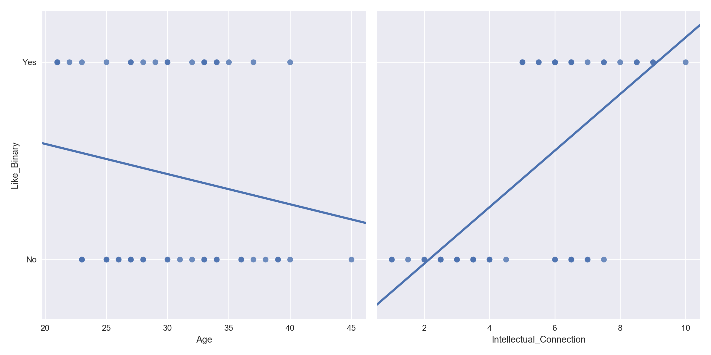

# My So-Called (Dating) Life

As part of my helping teach the "_Data Science: Intro to Python_" course, I made a database of some of my dating history.  It was used to introduce new students to Pandas -- see the accompanying [Jupyter Notebook](/intro_to_pandas_jpw_lecture.ipynb) for the actual lecture -- and I then wondered about the importance of factors in my own personal affinity for dating certain people versus others.  So, I quickly built a model to do a little investigating.  

### The Database Breakdown
My dating database had the following variables:

Variable                |  Type       | Values
------------------------|-------------|------
Age                     | Numeric     | 21 - 45
Height (in)             | Numeric     | 60 - 74
Attraction              | Numeric     | 0 - 10
Intellectual Connection | Numeric     | 0 - 10
Humor                   | Numeric     | 0 - 10
Chemistry*              | Numeric     | 0 - 10
Hair                    | Categorical | Blonde, Brunette, Red
Life Attitude           | Categorical | Positive, Neutral, Negative, Complainer
Politics                | Categorical | Left, Right, Independent
Income                  | Categorical | Low, Medium, High
Divorced                | Binary      | Yes, No
Kids                    | Binary      | Yes, No
Second Date?            | Binary      | Yes, No
Did I Like This Person? | Binary      | Yes, No

 __Table 1:__ The variables I assigned to each person in the database. Note the asterisk next to _Chemistry_.  This denotes that it was added only after an initial run without it included.

 

Let me quickly clarify how certain variables were assigned.  
+ __Attraction:__ Physical attraction only.
+ __Intellectual Connection:__ Basically the mental equivalent of attraction.
+ __Humor:__ How well our senses of humor aligned; did I laugh a lot with this person?
+ __Chemistry:__ The level of physical chemistry.
+ __Life Attitude:__ This is an appraisal of the person's general attitude in life.  
    + __Positive__: Generally optimistic, able to handle changes (even minor things like change of plans on a   date) well.  If the waiter makes a small mistake on their order, they just take off the unwanted food or, if necessary to address it, do so politely and don't mention it again.  Has a good view of the "big picture."  
    + __Neutral__: Depends on the mood or situation.  More of a 'nondescript' attitude.
    + __Negative__: Generally pessimistic.  Sees obstacles as larger than they are, lets little things bother them.  Would say things like "I don't want to go to [Place X] because they messed up my order one time."
    + __Complainer__: A specific sub-set of _Negative_, in that I found the person to be routinely not just negative in a "pessimistic about life" sense, but to explicitly complain about many things and people.  If the waiter made a mistake with their order, they would let it impact their ability to enjoy the meal, be fairly snarky to the waiter while demanding a correction, and finally -- and this is the _coup de grâce_ -- they would mention it as the first thing when someone asked about the date.  Like, who cares?  Your order wasn't perfect.  Wow.  Big deal.  Get a life.  How on earth these people can find any happiness in life, I will never know.
+ __Income:__ Since I don't have the tax returns of everyone in this database, I don't know exactly where they fall in income.  Things such as vocation, if they owned a home, neighborhood they lived in, type of car, cost of hobbies, and clothing and jewelry.  It is imperfect but is likely representative to a fair degree.  So I made the following rough annual income approximations.
    + __Low__: less than $40,000
    + __Medium__: between $40,000 and $80,000
    + __High__: above $80,000
+ __Second Date:__ Whether I saw this person a second time or not.  On the surface this seems like it would be an easy winner for most predictive variable -- if I "liked" someone then surely I'd see them again, right?  Well, life isn't always so cut-and-dried.  Sometimes circumstances change.  Sometimes you like someone that doesn't like you.  Sometimes you met only by chance to begin with.  Hence the inclusion of this feature.
+ __Did I Like This Person?:__ At the end of the day, whether I would consider full-on dating this person or not.  Ultimately, this is the target of the whole endeavor -- to find someone you'd like to date and, in my case, marry.

 

### A Super Model
My main interest in this mini-project was simple: to see which variables had the strongest relationship to predicting whether or not I liked someone enough to consider dating them.  For this I used a Gradient Boosted Classifier from __XG Boost__.  I intentionally overfit the model (500 trees, tree depth of 4, and learning rate of 50%) because I am not interested in building a predictive algorithm using the limited variables I have.  The primary issue in doing so is that some of the variables such as attraction, humor, intellectual connection, chemistry, politics, and second date can only be answered fairly after I've met someone.  Thus this is a _descriptive_ project and not an _inferential_ or _predictive_ one.

##### Data Prep
There were three stages to data prep in this project.  
1. Dummy the categorical and binary variables.
2. Address the _Age_ over-importance issue (see below).
3. Add _Chemistry_ feature.

### First Run - No Chemistry
Or, as they say in Russia, no "_chim-ih-stree_."  Initially I did not have the _Chemistry_ variable included, and it turns out this mattered.  We'll come back to this in our second run below.  Here are the top 10 features for the (overfit) GBC model:

Rank | Feature                 | Importance
-----|-------------------------|-----------
1    | Age                     | 54.9%
2    | Humor                   | 13.6%
3    | Attraction              | 13.6%
4    | Height (in.)            | 8.1%
5    | Intellectual Connection | 3.2%
6    | Hair Brunette           | 1.9%
7    | Second Date (No)        | 1.7%
8    | Attitude Positive       | 1.3%
9    | Politics Left           | 0.8%
10   | Income Low              | 0.8%

 __Table 2:__ The top 10 features from my initial run, without _Chemistry_, and without any data prep apart from dummied variables.

My initial reaction to this result was one of surprise.  Age?  Really?  That's the overwhelmingly most predictive feature for whether or not I liked someone?  That sure didn't _feel_ right, so I did a quick visual inspection to see if this made sense.

 __Figure 1:__ Comparison of Age and Intellectual Connection correlation to 'Liking' someone.

### What Factors Best Predict Whether I Will Want to Continue Dating Someone?
